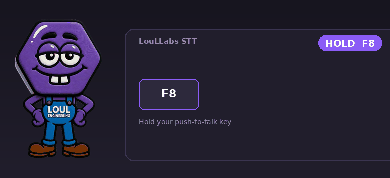

<p align="center">
  
</p>

<h1 align="center">LouLLabs&nbsp;STT</h1>

<p align="center">
  <b>100&nbsp;% local voice dictation for Windows.</b><br/>
  Hold a key, speak, release — the text is typed wherever your cursor is.
</p>

<p align="center">
  
  
  
  
  
</p>

```
HOLD F8  →  🎙️ mic  →  🔴 recording  →  Whisper (local)  →  ⌨️ text inserted
```

**LouLLabs STT** (Speech&nbsp;to&nbsp;Text) transcribes your voice into text, entirely locally,
with no internet connection after the first launch. No audio data ever leaves your machine,
and there is no telemetry. The Whisper model runs on the CPU (quantized to `int8`).

---

## ✨ Highlights

- **Private by default** — audio is never written to disk, zero network activity after the model download, zero telemetry.
- **No keylogger** — no global keyboard hook. The key is read through the Win32 API `GetAsyncKeyState` (a single key), **without administrator rights**. See [SECURITY.md](docs/SECURITY.md).
- **~0 RAM at rest** — the model loads on demand and **unloads automatically** after inactivity; it is preloaded while you speak to hide the latency.
- **Two simple modes** — *Automatic* (default), *Performance* (instantly ready), or *Economy* (frees resources when idle). No technical jargon exposed.
- **Faithful transcription** — the text is transcribed **faithfully to your voice, with no rewording by an AI**. No post-processing, no LLM, no "smart correction".
- **Anti-hallucination (multi-signal)** — an accidental press writes nothing: filtering that combines Whisper's known hallucinations ("Subtitles by…"), the **model's confidence** (`no_speech_prob`, `avg_logprob`, compression ratio), and the audio level — without ever "swallowing" a real sentence, even one spoken softly.
- **First-launch diagnostics** — detects the microphone, memory, and GPU, then you're off (no benchmark forced on you).
- **Reliable insertion** — the text is **typed directly** into the active field (without touching the clipboard), with an automatic fallback to Ctrl+V.
- **No-code configuration** — right-click the taskbar icon → *Settings* (key, language, model, microphone, mode, Windows startup).
- **Polished interface** — a translucent "liquid glass" overlay and the LouLLabs mascot.

---

## 🚀 Installation

**Requirements:** Windows 10/11 · [Python 3.10+](https://www.python.org/) (check *"Add Python to PATH"*) · a microphone.

```bash
git clone https://github.com/LouLLabs/LouLLabs_STT.git
cd LouLLabs_STT
pip install -r requirements.txt
python loullabs_stt.py
```

Or, without the command line: if you downloaded a ZIP, **extract it first** (right-click → *Extract All*), then, inside the extracted folder:

1. Double-click **`install.bat`** — installs what the app needs (just once). It does **not** launch anything.
2. Double-click **`build.bat`** — creates a single **`LouLLabs_STT.exe`** right here at the root of the folder.
3. Double-click **`LouLLabs_STT.exe`** — this is how you run the app from now on (you can move or pin that one file anywhere). It lives in the **system tray** (icon near the clock).

> **Three clear steps:** `install.bat` **installs** · `build.bat` **builds the `.exe`** · the **`.exe` runs** the app.

> The **first launch** downloads the default `small` model (~460 MB), just once. After that, everything is offline. (The *Accurate* mode `large-v3-turbo` downloads ~1.6 GB the first time you select it.)

---

## ⌨️ Usage

| Action | Result |
|--------|----------|
| **Hold F8** (default) | Records (overlay + mascot + blinking red dot) |
| **Release** | Transcribes and inserts the text into the active application |
| **Right-click the icon** in the taskbar | *Settings* / *Quit* |

The push-to-talk key is fully your choice: in *Settings*, click **"Detect a key"** and press whichever key you want — you're not limited to a preset list. The default transcription language is **English**.

---

## ⚙️ Settings

Everything is configurable from the *Settings* window (right-click the icon):
push-to-talk key, language (or auto-detection), **model** (3 choices), microphone,
**insertion method** (direct typing / Ctrl+V), **mode** (Automatic / Performance / Economy),
**acceleration** (Automatic), and launch at Windows startup.
To set the push-to-talk key, click **"Detect a key"** and press any key you like — you're not limited to a preset list.
The default transcription language is **English**.
The configuration is stored in `%APPDATA%\LouLLabs_STT\config.json` (advanced models — `tiny`, `medium`, `large-v3` — can be added there by hand).

| Label | Model | Size | EN quality | Perceived latency (CPU, all cores) |
|---------|--------|--------|------------|----------------------------------|
| Fast | `base` | ~140 MB | Fair | the lowest |
| **Balanced** ⭐ | `small` | ~460 MB | Good (≈ turbo on short dictation) | ~1 s |
| Accurate | `large-v3-turbo` | ~1.6 GB | Excellent | ~4 s |

> Default = **`small`**: on a benchmark (1–30 s dictation clips), it reaches ~1 s of perceived latency with quality nearly equivalent to turbo on short sentences, i.e. ~4× faster on CPU. Turbo (*Accurate*) is still one click away for long dictations or tricky proper nouns.

**Modes.** *Automatic*: balanced (unloads after a few minutes). *Performance*: model preloaded at startup, instantly ready, uses more resources. *Economy*: RAM freed quickly as soon as the app is idle.

---

## 📊 Performance

| Metric | Value |
|----------|--------|
| RAM at rest (model unloaded) | **~0 MB** added |
| RAM in use (`small` int8) | ~400 MB (turbo: ~880 MB) |
| CPU at rest | ~0% (reading one key every 15 ms) |
| Perceived latency, short dictation (`small`, all cores) | **~1 s** (turbo: ~4 s) |
| Transcription | CPU, `beam_size=3`, VAD active, **all cores** |

---

## 🏗️ Build a standalone .exe

Want a portable app that runs **without Python installed**? Just double-click
**`build.bat`**. It produces a **single self-contained file at the root of the folder**:

```
LouLLabs_STT.exe
```

That one file is the whole app — share it, pin it, or move it anywhere, then double-click
to run (icon included). Remember: **`install.bat` installs the dependencies, `build.bat`
produces the `.exe`** — run them in that order.

> **Alternative (no local build):** push a Git tag like `v1.5` — GitHub Actions builds the
> Windows `.exe` automatically and publishes `LouLLabs_STT-windows-x64.zip` on the *Releases* page.

The executable is not signed — see [SECURITY.md](docs/SECURITY.md).

---

## 🔬 Benchmark (advanced)

A standalone harness — `tools/benchmark.py` — measures what matters for short
dictation: **cold/warm start** latency and **quality (WER)** on a corpus
(everyday speech, fast speech, numbers, proper nouns, punctuation, silence…). Its purpose is
to decide on a future GPU backend **based on measurements**, not on a hunch.

Current verdict (CPU, all cores): `small` ≈ **~1 s** of perceived latency for
quality nearly identical to turbo on short dictation → the CPU is enough, and a
GPU backend is not needed for now (`vulkan`/`rocm` remain
extension points).

```bash
python tools/benchmark.py                    # records the corpus then measures (CPU)
python tools/benchmark.py --run              # re-measures on the already-recorded corpus
python tools/benchmark.py --model small --threads 0 --beam 3 --repeats 5
```

- `--threads 0` = all cores (default) · `--beam` = speed/accuracy trade-off.
- On Windows, double-click: `tools\benchmark.bat` (Accurate/turbo) or `tools\benchmark_small.bat` (Balanced/small).

The GPU backends (`vulkan` / `rocm` via whisper.cpp) are extension points
deliberately left as TODO — to be wired in **after** this benchmark.

---

## 🧱 Architecture

```
loullabs_stt.py       Application (single file)
├── Input Win32        GetAsyncKeyState (key) + SendInput (typing/Ctrl+V)
├── GlassOverlay       Translucent overlay (ready / recording / transcription / success / error)
├── STTEngine          Engine: lazy-load + RAM unload, capture, transcription, insertion
├── HotkeyWatcher      Key reading (~15 ms) on the Qt thread
└── SettingsDialog     Settings window (right-click the icon)
```

Dependencies: `faster-whisper`, `sounddevice`, `numpy`, `pyperclip`, `PySide6`.

---

## 🔒 Security

The security and privacy posture is detailed in **[SECURITY.md](docs/SECURITY.md)**
(no global keyboard hook, no network after the model, `bandit` scan with no High/Medium alerts…).

## 📄 License

Project licensed under [MIT](LICENSE) — © 2026 LouLLabs.

Third-party components retain their own licenses (MIT, BSD, and **LGPL** for
Qt/PySide6 and FFmpeg). The details and LGPL compliance are documented in
**[THIRD_PARTY_LICENSES.md](docs/THIRD_PARTY_LICENSES.md)**. The Whisper model weights
(OpenAI, MIT) are downloaded on demand and are not redistributed here.

<p align="center"><sub>A <a href="https://www.loullabs.com/">LouLLabs</a> tool.</sub></p>
